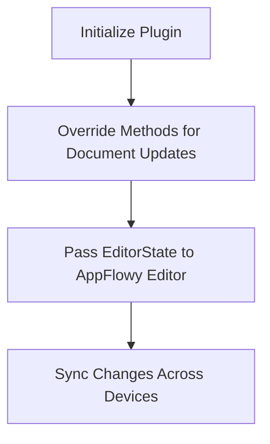
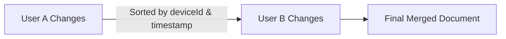

# AppFlowy Editor Sync Plugin

This plugin enables seamless content synchronization for the AppFlowy text editor across devices and users. It leverages CRDT (Conflict-free Replicated Data Type) structures from the `yrs` library to ensure consistent merging of changes, regardless of the order or frequency of updates.

## Key Features

- **Full Offline Support**: Synchronize changes even when devices are offline.
- **Customizable Synchronization**: Override methods to handle document updates and storage.
- **Cross-Platform Compatibility**: Works across all Flutter platforms, including Wear OS.

## How It Works



### Initialization

To initialize the plugin, add the following code to your `main` function:

```dart
void main() async {
  WidgetsFlutterBinding.ensureInitialized();
  await AppflowyEditorSyncUtilityFunctions.initAppFlowyEditorSync();

  runApp(App());
}
```

### Overriding Methods

Override the following methods to handle document update storage and retrieval:

```dart
@Riverpod(keepAlive: true)
class EditorStateWrapper extends _$EditorStateWrapper {
  @override
  FutureOr<EditorState> build(String docId) {
    final wrapper = EditorStateSyncWrapper(
      syncAttributes: SyncAttributes(
        getInitialUpdates: () async {
          // Provide initial updates or initialize the editor.
        },
        getUpdatesStream: ...,
        saveUpdate: (Uint8List update) async {
          // Save updates.
        },
      ),
    );

    return wrapper.initAndHandleChanges();
  }
}
```

Pass the resulting `EditorState` to the AppFlowy text editor. Refer to the example for more details.

## Document Initialization

When creating a document, use one of the following methods from `AppflowyEditorSyncUtilityFunctions`:

- `initDocument`
- `initDocumentFromExistingDocument`
- `initDocumentFromExistingMarkdownDocument`

These methods set up the default document structure for future updates.

## Web Integration

To use the plugin on the web:

1. Copy the code from the package `web/pkg` into your project’s `web/pkg` folder.
2. Add the following HTML headers:
   - `Cross-Origin-Opener-Policy=same-origin`
   - `Cross-Origin-Embedder-Policy=require-corp`

Useful resources:

- [Flutter Rust Bridge Quickstart](https://cjycode.com/flutter_rust_bridge/quickstart#3-run-it)
- [Flutter Rust Bridge Web Setup](https://cjycode.com/flutter_rust_bridge/manual/integrate/template/setup/web)

## Behind the Scenes

The plugin builds on AppFlowy’s approach to convert transactions into structures compatible with the Rust-based `yrs` library. This ensures a synchronized copy of the text editor across devices. However, CRDT alone may produce unexpected results when users’ changes interleave.

### Example of CRDT Merge Issue

#### User A (offline):
- 111 - User A
- 222 - User A
- 333 - User A

#### User B (offline):
- 111 - User B
- 222 - User B
- 333 - User B

#### Naive Merge Result:
- 111 - User A
- 111 - User B
- 222 - User A
- 333 - User A

To address this, the plugin uses additional attributes for each text node:

- `deviceId`
- `timestamp`

And pointers:

- `prevId` (for reflection and sorting)
- `nextId` (for CRDT reflection)

### Improved Merge Result



For conflicts (e.g., multiple nodes with the same prevId), the sorting algorithm uses timestamp and deviceId to resolve ordering. This logic is implemented in rust/src/doc/utils/sorting.rs.

After updating the CRDT struture, an CRDT binary update is returned that should be then stored. After new binary updates come from a DB, these updates are then combined and form a CRDT document that is then compared with the current one and differences are applied to the current editor.

## Code Structure

Code is written both in Dart and Rust.

### Rust

Main files or folders are listed bellow:

- src/doc:

  - `document_service` - Service used for communicatinio between Rust and Dart part.
  - `utils`
    - `sorting.rs` - Sorts the current CRDT state into user expected state
    - `sorting_test.rs` and sorting_test2.rs - Contains tests generated by AI and reviewed for their validity.
  - `operations`
    - `block_ops.rs` - Handles insersts, deletes, updates, and moves.
    - `delta_ops.rs` - Handle operations releated to text that is stored in Delta Format.
    - `update_ops.rs` - Handles applying CRDT updates and extraction of current CRDT state into a state that Dart side understands.
  - `conversions`
    - `conversion.rs` - Responsible for conversions between JSON and yrs formats.

### Flutter (Dart)

Main files or folders are listed bellow:

- lib:

  - `editor_state_sync_wrapper.dart` - Listenes for updates from editor or DB and puts everything together.
  - `appflowy_editor_sync_utility_functions.dart` - Contains usefull function for creating new documents and merging updates.
  - `extensions` - Contains files adding extentions to default Appflowy Editor classes or classes generated from the Rust side
  - `document_service_helpers`
    - `document_service_wrapper` - Wrapper around `DocumentService` from Rust that gurateese that CRDT structure on the other side is affected only by one call at a time
    - `diff_deltas.dart` - Function for computing Deltas (Delta Format) with adjustments to make it work with YText format.
    - `document_rules` - Validates the new editor state and if neccessary fixes it.
  - `core` - Helper structures batching and update clock.
  - `src/rust` - Contains generted code by flutter_rust_bridge.

## Demo

Check out the demo with custom synchronization: [Demo Link](https://github.com/Musta-Pollo/custom_supabase_drift_doc_sync)

Live demo: [HabitMaster](https://habitmaster-e52e9.web.app/)


The demo showcases live synchronization, including handling offline scenarios by toggling Wi-Fi. It works across all Flutter platforms and Wear OS when properly configured.
